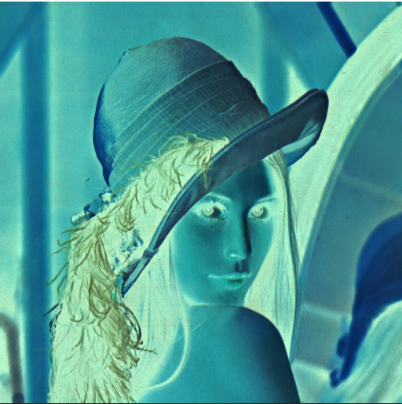

# Programming Assignment 2
고급 컴퓨터 그래픽스의 Programming Assignment 2의 소스코드와 Build File이 있습니다.

## External Libraries
glm

lodepeng

## Controls
클릭 : 필터링 모드 변환

    0 : 일반

    1 : Negative

    2 : Sobel Edge Detection

    3 : Toon Render

좌우 방향키 : Threshold 조절

    Sobel Edge Detection의 검출 threshold를 조절합니다. (0.0~1.0)

조작의 결과는 콘솔에 출력됩니다.

 

sobel Edge Detection의 Threshold값에 따른 이미지 변화

thresh : 0

thresh : 0.5

thresh : 1

